# KBOM Tools

Tools and experiments related to [Trivy KBOM (Kubernetes Bill of Materials)](https://aquasecurity.github.io/trivy/v0.46/docs/target/kubernetes/#kbom).

The [Makefile](/Makefile) in this repo provides a quick way to experiment:

```
make <filename>.[json|dot|dot.svg|mmd|mmd.svg] IN=<kbom.cdx.json>
```

## Simpler KBOM

Trivy's KBOM is designed around [CycloneDX](https://cyclonedx.org/docs/1.5/json/) which is highly normalized data model. This makes it good for data longevity but at the same time not less user friendly. In order to make KBOM simpler to read and consume, and more closely aligned with the mental model of Kubernetes users, we convert it to a simpler model:

- cluster information fields
- control plane
  - nodes
  - components
- nodes
- components

To convert a Trivy KBOM file `my.cdx.json` into Simple KBOM file called `my.skbom.json`:

```
make my.skbom.json IN=my.cdx.json
```

## Graphviz dot

To convert a "Simple KBOM" file `my.skbom.json` into [GraphViz](https://graphviz.org) [dot](https://graphviz.org/doc/info/lang.html) called `my.skbom.dot`:

```
make my.skbom.dot IN=my.cdx.json
```

You can also generate an SVG image:

```
make my.skbom.dot.svg IN=my.skbom.json
```

## Mermaid JS Flowchart

To convert "Simple KBOM" file `my.skbom.json` into [Mermaid](https://mermaid.js.org) [Flowchart](https://mermaid.js.org/syntax/flowchart.html) called `my.skbom.mmd`:

```
make mmd IN=my.skbom.json
```

You can also generate an SVG image: 

```
make my.skbom.mmd.svg IN=my.skbom.json
```

